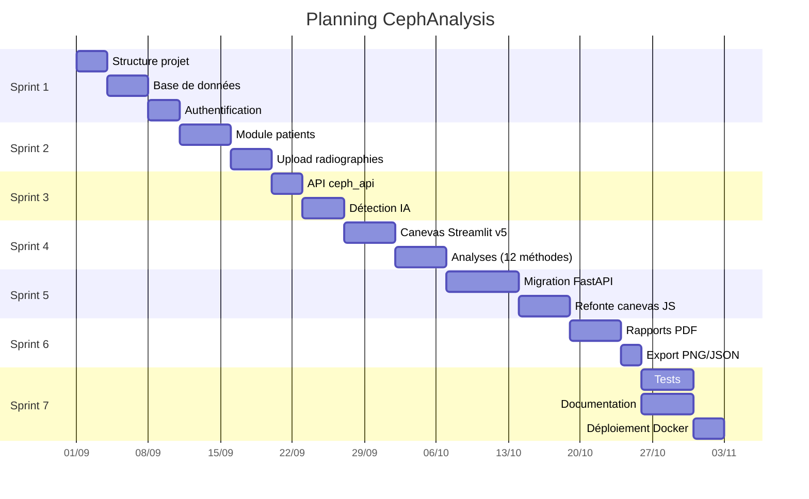

# Gestion de Projet

## 1. Méthodologie : SCRUM Adaptée

Le projet a été développé selon une méthodologie agile SCRUM adaptée au contexte de formation.

### Rôles

| Rôle | Personne |
|------|----------|
| Product Owner | Formateur / Maître de stage |
| Scrum Master | Développeur |
| Équipe de développement | 1 développeur |

### Sprint Planning

| Sprint | Durée | Objectif |
|--------|-------|----------|
| Sprint 1 | 2 semaines | Structure du projet, authentification, base de données |
| Sprint 2 | 2 semaines | Module patients, upload radiographies |
| Sprint 3 | 2 semaines | IA détection landmarks, API ceph_api |
| Sprint 4 | 2 semaines | Canevas interactif, analyses (archivé Streamlit v5) |
| Sprint 5 | 2 semaines | Migration Streamlit → FastAPI, refonte complète |
| Sprint 6 | 1 semaine | Rapports PDF, export, finalisation |
| Sprint 7 | 1 semaine | Tests, documentation, déploiement Docker |

### Rituels

| Rituel | Fréquence | Durée |
|--------|-----------|-------|
| Daily standup | Quotidien | 5 min |
| Sprint review | Fin de sprint | 30 min |
| Sprint retrospective | Fin de sprint | 15 min |
| Backlog grooming | Hebdomadaire | 20 min |

## 2. Workflow Git (Gitflow)

```
main
  ├── develop
  │    ├── feature/auth
  │    ├── feature/patients
  │    ├── feature/radios
  │    ├── feature/ceph-api
  │    ├── feature/canvas
  │    ├── feature/reports
  │    └── feature/deploy
  └── hotfix/*
```

### Convention de commits

```
feat: ajout module patients CRUD
fix: correction calcul angle SNA dans canvas
refactor: migration Streamlit → FastAPI (routers MVC)
docs: mise à jour ARCHITECTURE.md
test: ajout tests unitaires auth
chore: configuration Docker Compose
```

## 3. Outils de Gestion de Projet

| Outil | Usage |
|-------|-------|
| GitHub / Git | Versionnement du code |
| Trello / Notion | Backlog et suivi des tâches |
| Discord / Slack | Communication quotidienne |
| Google Drive | Partage des documents (cahier des charges, rapport) |

## 4. Workflow de Développement

```
1. Création d'une branche feature depuis develop
2. Développement + tests unitaires
3. Pull request → review
4. Merge dans develop
5. Tests d'intégration
6. Merge dans main (fin de sprint)
7. Déploiement Docker
```

## 5. Diagramme de Gantt


